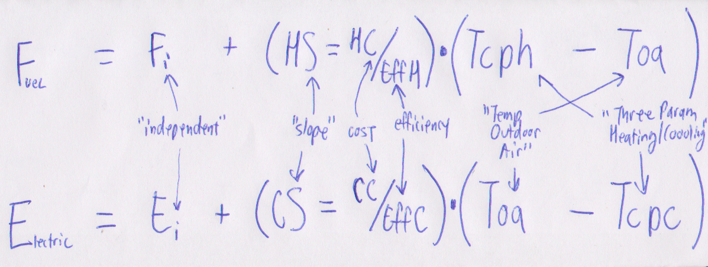

```{r, echo=FALSE, message=FALSE, error=FALSE, warning=FALSE}
library(ggplot2)
library(knitr)
library(dplyr)
library(weatherData)
library(stringr)
library(changepoint)
library(bcp)
```

# Methodology Doc:

1. Acquire energy consumption data for 5 facilities (electricity, fuel energy)

```{r, echo=FALSE, message=FALSE, error=FALSE, warning=FALSE}
files <- c("EXC","LIC","MFC","MSC","SUN")

df_exc <- read.csv("data/EXC.csv", stringsAsFactors = FALSE)
df_exc$Facility <- "EXC"

df_lic <- read.csv("data/LIC.csv", stringsAsFactors = FALSE)
df_lic$Facility <- "LIC"

df_mfc <- read.csv("data/MFC.csv", stringsAsFactors = FALSE)
df_mfc$Facility <- "MFC"

df_msc <- read.csv("data/MSC.csv", stringsAsFactors = FALSE)
df_msc$Facility <- "MSC"

df_sun <- read.csv("data/SUN.csv", stringsAsFactors = FALSE)
df_sun$Facility <- "SUN"

df <- df_exc
df <- rbind(df, df_lic)
df <- rbind(df, df_mfc)
df <- rbind(df, df_msc)
df <- rbind(df, df_sun)

df$Start_Date <- as.Date(df$Start_Date, format = "%d-%b-%y")
df$End_Date <- as.Date(df$End_Date, format = "%d-%b-%y")

df$Facility <- as.factor(df$Facility)

df$MonthYear <- format(as.Date(df$End_Date), "%Y-%m")
```

8. Simulate outdoor air temperatures (what should the distribution be?), find total energy consumption (E).

```{r}
NYC_weather <- read.csv("data/NYNEWYOR.csv", header=FALSE)
colnames(NYC_weather) <- c("Month", "Day", "Year", "AveTemp")
NYC_weather$Month <- str_pad(NYC_weather$Month, 2, pad = "0")
NYC_weather
```


```{r}

```


```{r}

```


Kissock's Calcs...

All Acronyms:

* 3PC = 3 Param Cooling (ELECTRICITY)
* 3PH = 3 Param Heating (FUEL)
* Heating: Fi = Fuel Use INDEPENDENT (function of hot water, process heating, etc.), HS = Heat Slope, Tcph = Heating change-point, Toa = Temp Outdoor Air
* Cooling: Ei = Electric Use INDEPENDENT (function of lights, plug loads, etc.), CS = Cooling Slope, Tcpc = Cooling Change-point, Toa = Temp Outdoor Air

3pc is 3 param cooling (electricity), 3ph is 3 param heating (fuel)

* HS and CS: heating and cooling slopes: heating/cooling energy per degree of temperature.
* Slopes function of:
  + Envelope Heat Loss/Gain HC = CC UA + V p cp
  + Efficiency of heating/cooling equipment: Effh and Effc
* HS = HC / Effh
* CS = CC / Effc

* TBH and TBC are BALANCED TEMPERATURES (temps where heating/cooling begins), its a function of
  + TSP = Thermostat Set Point
  + Qi = Internal Heat Gain
* TBH = Tsp - Qi/HC
* TBC = Tsp - Qi/CC

(We want to predict energy use based solely on 1) monthly time scale and 2) outdoor air temp)

Other (not used) acronyms:
* Solar Radiation = S
* Humidity = H
* Wind Speed = W

NOTE: Important to normalize by square footage, so that you get energy per degree of temperature per square foot.

```{r}
# so ONLY toa param is in both funcs...



```

# Try to apply to the data...


```{r}
kable(head(df, n=10))

ggplot(data=df, aes(x=Start_Date, y=Elec, group=Facility, shape=Facility, color=Facility)) + ggtitle("Elec") + geom_line() + geom_point()

ggplot(data=df, aes(x=Start_Date, y=Fuel, group=Facility, shape=Facility, color=Facility)) + ggtitle("Fuel") + geom_line() + geom_point()

```

Floor area:
```{r}
Facility <- c("MSC", "MFC", "EXC", "SUN", "LIC")
Gross.floor.area <- c(212500, 481000, 59000, 242062, 59300)
Floor.area <- cbind(Facility, Gross.floor.area) %>% as.data.frame()
Floor.area$Facility <- as.factor(Floor.area$Facility)

df <- left_join(df, Floor.area, by = "Facility")
```

Get temp data:

```{r}
NYC_weather <- read.csv("data/NYNEWYOR.csv", header=FALSE)
colnames(NYC_weather) <- c("Month", "Day", "Year", "AveTemp")
NYC_weather$Month <- str_pad(NYC_weather$Month, 2, pad = "0")
```

```{r}
NYC_month_ave <-aggregate(AveTemp ~ Month + Year, NYC_weather, mean)
NYC_month_ave$MonthYear = paste(NYC_month_ave$Year, "-", NYC_month_ave$Month, sep = "")
```

```{r}
df <- left_join(df, NYC_month_ave, by = "MonthYear") %>% 
  select(MonthYear, Elec, Fuel, Facility, Gross.floor.area, AveTemp)
```


# Save the Dataframe

```{r}
save(df, file = "report_dataframe.Rda")
```


EDA
```{r}
ggplot(df, aes(x = AveTemp, y = Elec)) + geom_point() + stat_smooth()
```

```{r}
ggplot(df, aes(x = AveTemp, y = Elec, color = Facility)) + geom_point() + stat_smooth()
```

```{r}
ggplot(df, aes(x = AveTemp, y = Fuel)) + geom_point() + stat_smooth()
```
```{r}
ggplot(df, aes(x = AveTemp, y = Fuel, color = Facility)) + geom_point() + stat_smooth()
```


Changepoint Analysis

```{r}
elec.bcp <- bcp(y = df$Elec, x = df$AveTemp)
plot(elec.bcp)
```

```{r}
fuel.bcp <- bcp(y = df$Fuel, x = df$AveTemp)
plot(fuel.bcp)
```


## Inverse Modeling (Dan)


```{r message=FALSE, warning=FALSE, echo=FALSE}
library(sqldf)
#kable(head(df, n=5))
```

At first glance, it may be difficult to see a heating+cooling pattern in the individual buildings:

```{r message=FALSE, warning=FALSE, echo=FALSE}

# take logs?
#df$Elec = log(df$Elec)
#df$Fuel = log(df$Fuel)


#Normalized Data
df$Elec <- (df$Elec-min(df$Elec))/(max(df$Elec)-min(df$Elec))
df$Fuel <- (df$Fuel-min(df$Fuel))/(max(df$Fuel)-min(df$Fuel))

ggplot(df, aes(x=AveTemp, group=Facility, shape=Facility, color=Facility)) + ylab("HEAT or ELEC") + geom_point(aes(y = Elec, color=Facility)) + geom_line(aes(y = Elec, color=Facility)) + geom_point(aes(y = Fuel, color=Facility)) + geom_line(aes(y = Fuel, color=Facility))

```

So to get an overall view, we will use the cumulative normalized Fuel + Electricity Usage:

```{r message=FALSE, warning=FALSE, echo=FALSE}
forward_func_electric_for_temp <- function(temp){
  q <- paste('select avg(Elec) from df where AveTemp > ', temp-5,' and AveTemp < ',temp+5, sep = "")
  avg_temp <- sqldf(q)
  return (as.numeric(avg_temp))
}

forward_func_fuel_for_temp <- function(temp){
  q <- paste('select avg(Fuel) from df where AveTemp > ', temp-5,' and AveTemp < ',temp+5, sep = "")
  avg_temp <- sqldf(q)
  return (as.numeric(avg_temp))
}


temps_in <- seq(20,80,10)
electric_out <- c()
fuel_out <- c()
for(temp in temps_in){
  electric <- forward_func_electric_for_temp(temp)
  electric_out <- c(electric_out, electric)
  fuel <- forward_func_fuel_for_temp(temp)
  fuel_out <- c(fuel_out, fuel)
}

# normalize them: 
#Normalized Data
electric_out = (electric_out-min(electric_out))/(max(electric_out)-min(electric_out))
fuel_out = (fuel_out-min(fuel_out))/(max(fuel_out)-min(fuel_out))

temp_elec_fuel <- data.frame(cbind(temps_in, electric_out, fuel_out))
colnames(temp_elec_fuel) <- c("TEMPR","ELEC","FUEL")

kable(temp_elec_fuel)


ggplot(temp_elec_fuel, aes(x=TEMPR)) + ylab("HEAT or ELEC") + geom_point(aes(y = ELEC, color="blue")) + geom_line(aes(y = ELEC, color="blue")) + geom_point(aes(y = FUEL, color="red")) + geom_line(aes(y = FUEL, color="red"))

```

Below is some recorded temperatures in NYC:

```{r message=FALSE, warning=FALSE, echo=FALSE}
kable(head(NYC_weather))

```

So given a temperature sample f(x), we can look up the heat and/or electric (f inverse) using that chart. we'll assume that for any given month, the mean temperature is normally distributed.  Thus we will sample from the temperatures using different sampling strategies and calculate the inverse heat or electric based upon each sample.

* Set whole month temp to most extreme value from that month:

```{r message=FALSE, warning=FALSE, echo=FALSE}


```


```{r message=FALSE, warning=FALSE, echo=FALSE}
# the initial funcs, just based on the reading...

three_param_heating_3PH_fuel_model <- function(fuel_in_FI, heat_slope_HS, tcph, toa){
  the_fuel <- fuel_in_FI + heat_slope_HS * (tcph - toa)
}

three_param_cooling_3PC_electricity_model <-  function(elec_in_EI, cool_slope_CS, tcpc, toa){
  the_fuel <- fuel_in_FI + heat_slope_HS * (tcpc - toa)
}

# the updated funcs after seeing the data:

heat_func_2 <- function(independent, heat_slope_HS, heat_model, air_temp){
  the_fuel <- independent + heat_slope_HS * (heat_model - air_temp)
  return (the_fuel)
}

cooling_func_2 <-  function(independent, cool_slope_CS, cool_model, air_temp){
  the_fuel <- independent + cool_slope_CS * (cool_model - air_temp)
  return (the_fuel)
}


```


