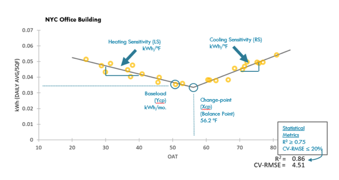

```{r global_options, include=FALSE}
knitr::opts_chunk$set(echo=FALSE, warning=FALSE, message=FALSE)
```

```{r, message = F, warning=F}
load("report_dataframe.Rda")
#general
library(dplyr)
library(knitr)
library(stringr)
library(sqldf)

#graphing
library(ggplot2)
library(grid)
library(gridExtra)

#statistical
library(changepoint)

options(scipen=999)
library(devtools)
```


# Abstract


# Introduction  
The U.S Energy Information Administration's Commercial Buildings Energy Consumption Survey (CBECS) estimates that there were 5.6 million commercial buildings in the United States in 2012, comprising 87 billion square feet of floorspace. These buildings consumed 6,963 trillion Btu in site energy. In 2014, New York City buildings were responsible for 73 percent of citywide greenhouse gas (GHG) emissions through the use of natural gas, electricity, heating oil, steam, and biofuel.   
  
We propose to build on the methodology described in the papers below on change-point regression modeling of building energy use to investigate energy use in New York City. The practice of using inverse modeling to analyze historical facility energy consumption has been widely researched and employed in the industry since the late 1990s; however, the proposed inverse simulation methodology is a relatively new concept and has not been widely reviewed in the literature. As the research in question was developed on industrial facilities and single-family homes, it is unclear as to whether the methodology is applicable to the commercial real estate sector (i.e., office buildings) in New York City.

# Literature Review  


# Methodology




## Data Sources & Preparation


## Building Comparison (Sonya)


## Change-point Regression
Heating and cooling energy consumption varies according to ambient air temperature in addition to baseline use for non-temperature regulating consumtion like cooking (gas) or lighting (electricity). A changepoint analysis was preformed on both electricty and fuel data using the R package *changepoint* (Killick and Eckley, 2014). 

The changepoint analysis  utilized the AMOC method (At Most One Change) to specify a single changepoint for each electricity and fuel consumption series with no loss function. For electricty, the changepoint was determined using the mean of the electricty load data. Given the wide range of electricity loads over the observed temperature range, the change in mean at warmer temperatures leads to an identifiable changepoint. For fuel, both mean and variance changes were incorporated to determine the changepoint, as at warmer temperatures there is very little change in the fuel load (i.e. the baseline load has very little variance, but the load during warming temperatures does).  

After determining the changepoints, a linear regression model was fit to the electricty load observations at temperatures greater than or equal to the changepoint. For fuel load  the linear regression model was fit to observations less than or equal to the changepoint. These two linear models represent the observed response rates of energy load to changes in average monthly outside air temperature. 

```{r}
get.elec.changepoint <- function(building, data){
  cp.elec.data <- data %>%
    filter(Facility == building) %>%
    select(Elec, AveTemp) %>%
    arrange(AveTemp)

  cp.elec <- cpt.mean(cp.elec.data[,1], method = 'AMOC', penalty = 'None')
  return(cp.elec.data[cpts(cp.elec),])
}

elec.changepoints <- sapply(unique(df$Facility), FUN = get.elec.changepoint, data = df)
colnames(elec.changepoints) <- unique(df$Facility)

plot.changepoint.elec <- function(data, series, facility, changepoint){
  df <- filter(data, Facility == facility)
  
  g <- ggplot(df, aes_string(x = "AveTemp", y = series)) + 
    geom_point() + 
    geom_vline(xintercept = as.numeric(changepoint)) + 
    ggtitle(facility) + 
    stat_smooth(method = lm, data = df %>% filter(AveTemp >= changepoint), mapping = aes_string(x = "AveTemp", y = series))
  
  return(g)
}
kable(elec.changepoints)

grid.arrange(plot.changepoint.elec(df, "Elec", "EXC", elec.changepoints[2,1]),
             plot.changepoint.elec(df, "Elec", "LIC", elec.changepoints[2,2]),
             plot.changepoint.elec(df, "Elec", "MFC", elec.changepoints[2,3]),
             plot.changepoint.elec(df, "Elec", "MSC", elec.changepoints[2,4]),
             plot.changepoint.elec(df, "Elec", "SUN", elec.changepoints[2,5]),
             ncol = 3, nrow = 2)
```


```{r}
get.fuel.changepoint <- function(building, data){
  cp.fuel.data <- data %>%
    filter(Facility == building) %>%
    select(Fuel, AveTemp) %>%
    arrange(AveTemp)

  cp.fuel <- cpt.meanvar(cp.fuel.data[,1], method = 'AMOC')
  
  return(cp.fuel.data[cpts(cp.fuel),])
}

fuel.changepoints <- sapply(unique(df$Facility), FUN = get.fuel.changepoint, data = df)
colnames(fuel.changepoints) <- unique(df$Facility)

plot.changepoint.fuel <- function(data, series, facility, changepoint){
  df <- filter(data, Facility == facility)
  
  g <- ggplot(df, aes_string(x = "AveTemp", y = series)) + 
    geom_point() + 
    geom_vline(xintercept = as.numeric(changepoint)) + 
    ggtitle(facility) + 
    stat_smooth(method = lm, data = df %>% filter(AveTemp <= changepoint), mapping = aes_string(x = "AveTemp", y = series))
  
  return(g)
}

kable(fuel.changepoints)

grid.arrange(plot.changepoint.fuel(df, "Fuel", "EXC", fuel.changepoints[2,1]),
             plot.changepoint.fuel(df, "Fuel", "LIC", fuel.changepoints[2,2]),
             plot.changepoint.fuel(df, "Fuel", "MFC", fuel.changepoints[2,3]),
             plot.changepoint.fuel(df, "Fuel", "MSC", fuel.changepoints[2,4]),
             plot.changepoint.fuel(df, "Fuel", "SUN", fuel.changepoints[2,5]),
             ncol = 3, nrow = 2)
```

```{r}

# EXC

EXC.fuel.lm <- lm(Fuel ~ AveTemp, 
                  data = df %>% 
                    filter(Facility == "EXC") %>%
                    filter(AveTemp <= fuel.changepoints[2,1]))


EXC.elec.lm <- lm(Elec ~ AveTemp, 
                  data = df %>% 
                    filter(Facility == "EXC") %>%
                    filter(AveTemp >= elec.changepoints[2,1]))


EXC.temp.model <- function(t){
  ifelse(t <= elec.changepoints[2,1], 
         return(elec.changepoints[1,1]),
         return(predict(EXC.elec.lm, newdata = data.frame(AveTemp = t))))
}


# LIC

LIC.elec.lm <- lm(Elec ~ AveTemp,
                  data = df %>%
                    filter(Facility == "LIC") %>%
                    filter(AveTemp >= elec.changepoints[2,2]))


LIC.fuel.lm <- lm(Fuel ~ AveTemp,
                  data = df %>%
                    filter(Facility == "LIC") %>%
                    filter(AveTemp <= fuel.changepoints[2,2]))

LIC.temp.model <- function(t){
  ifelse(t <= elec.changepoints[2,2],
         return(elec.changepoints[1,2]),
         return(predict(LIC.elec.lm, newdata = data.frame(AveTemp = t))))
}


# MFC

MFC.elec.lm <- lm(Elec ~ AveTemp,
                  data = df %>%
                    filter(Facility == "MFC") %>%
                    filter(AveTemp >= elec.changepoints[2,3]))


MFC.fuel.lm <- lm(Fuel ~ AveTemp,
                  data = df %>%
                    filter(Facility == "MFC") %>%
                    filter(AveTemp <= fuel.changepoints[2,3]))

MFC.temp.model <- function(t){
  ifelse(t <= elec.changepoints[2,3],
         return(elec.changepoints[1,3]),
         return(predict(MFC.elec.lm, newdata = data.frame(AveTemp = t))))
}

# MSC

MSC.elec.lm <- lm(Elec ~ AveTemp,
                  data = df %>%
                    filter(Facility == "MSC") %>%
                    filter(AveTemp >= elec.changepoints[2,4]))


MSC.fuel.lm <- lm(Fuel ~ AveTemp,
                  data = df %>%
                    filter(Facility == "MSC") %>%
                    filter(AveTemp <= fuel.changepoints[2,4]))

MSC.temp.model <- function(t){
  ifelse(t <= elec.changepoints[2,4],
         return(elec.changepoints[1,4]),
         return(predict(MSC.elec.lm, newdata = data.frame(AveTemp = t))))
}
  
# SUN

SUN.elec.lm <- lm(Elec ~ AveTemp,
                  data = df %>%
                    filter(Facility == "SUN") %>%
                    filter(AveTemp >= elec.changepoints[2,5]))


SUN.fuel.lm <- lm(Fuel ~ AveTemp,
                  data = df %>%
                    filter(Facility == "SUN") %>%
                    filter(AveTemp <= fuel.changepoints[2,5]))

SUN.temp.model <- function(t){
  ifelse(t <= elec.changepoints[2,5],
         return(elec.changepoints[1,5]),
         return(predict(SUN.elec.lm, newdata = data.frame(AveTemp = t))))

}

```

```{r, eval = T}
elec.changepoints <- as.data.frame(elec.changepoints)

B.elec.lm <- function(bldg) {
    bldg.elec.lm <- lm(Elec ~ AveTemp, 
                  data = df %>% 
                    filter(Facility == bldg) %>%
                    filter(AveTemp >= elec.changepoints["AveTemp",]$bldg))
    return(bldg.elec.lm)
}

B.fuel.lm <- function(bldg) {
  bldg.fuel.lm <- lm(Fuel ~ AveTemp, 
                  data = df %>% 
                    filter(Facility == bldg) %>%
                    filter(AveTemp <= fuel.changepoints["AveTemp",]$bldg))
  return(bldg.fuel.lm)

}

B.temp.model <- function(bldg, t){
  
  bldg.elec.lm <- B.elec.lm(bldg)

  bldg.fuel.lm <- B.fuel.lm(bldg)
  
  building.changepoint <- elec.changepoints[2,] %>% select_(bldg)
  baseline <- elec.changepoints[1,] %>% select_(bldg)
  
  print(building.changepoint)
  print(baseline)
  ifelse(t <= building.changepoint, 
         return(baseline),
         return(predict(bldg.elec.lm, newdata = data.frame(AveTemp = t))))
}

B.elec.lm('LIC')
B.temp.model("LIC", 80)

```


### Weather Sampling Utilities: 

We need a single temperature per month, but that single temperature can be chosen in a variety of ways.  Various strategies could include the following:

* The mean temperature for the specified month and year
* The maximum temperature for the specified month and year
* The minimum temperature for the specified month and year
* The maximum temperature for the specified month for ALL years

```{r}
# DAN: need this for sampling below....leaving on top of ##...
NYC_weather <- read.csv("data/NYNEWYOR.csv", header=FALSE)
colnames(NYC_weather) <- c("Month", "Day", "Year", "AveTemp")
NYC_weather$Month <- str_pad(NYC_weather$Month, 2, pad = "0")
NYC_weather <- NYC_weather[NYC_weather$AveTemp >= -80, ] 
#kable(head(NYC_weather))


month_avgs <- sqldf("select Year, Month, avg(AveTemp) as MonthAvg from NYC_weather group by Year, Month order by Year, Month")

p1 <- ggplot(data=month_avgs, aes(x=Month, y=MonthAvg, group=Year, color=Year)) + ggtitle("Monthly Avg Temp for MM/YY") + geom_line() + geom_point() + ylim(0, 100)

month_maxes <- sqldf("select Year, Month, max(AveTemp) as MonthMax from NYC_weather group by Year, Month order by Year, Month")

p2 <- ggplot(data=month_maxes, aes(x=Month, y=MonthMax, group=Year, color=Year)) + ggtitle("Monthly Max Temp for MM/YY") + geom_line() + geom_point() + ylim(0, 100)

month_mins <- sqldf("select Year, Month, min(AveTemp) as MonthMin from NYC_weather group by Year, Month order by Year, Month")

p3 <- ggplot(data=month_mins, aes(x=Month, y=MonthMin, group=Year, color=Year)) + ggtitle("Monthly Min Temp for MM/YY") + geom_line() + geom_point() + ylim(0, 100)

month_maxes_all_years <- sqldf("select Month, max(AveTemp) as MonthMaxAllYrs from NYC_weather group by Month order by Month")

p4 <- ggplot(data=month_maxes_all_years, aes(x=Month, y=MonthMaxAllYrs)) + ggtitle("Monthly Max Temps for All Years") + geom_line() + geom_point() + ylim(0, 100)

grid.arrange(p1, p2, p3, p4, ncol = 2)


# DAN: all below is NOT IN USE - ie legacy - can delete....

get_n_hottest_days_of_month <- function(df, month_num, num_days){
  return (get_hi_lo_of_month(df, month_num, TRUE, num_days))
}

get_n_coldest_days_of_month <- function(df, month_num, num_days){
  return (get_hi_lo_of_month(df, month_num, FALSE, num_days))
}

get_n_random_days_of_month <- function(df, month_num, num_days){
  indexes <- c(1:28)
  indexes <- sample(indexes, num_days)
  df <- get_hi_lo_of_month(df, month_num, FALSE, 28)
  return (df[indexes])
}

get_avg_day_of_month <- function(df, month_num){
  month_num <- str_pad(month_num, 2, pad = "0")
  month_result <- df %>%
    filter(Month == month_num)
  return (mean(month_result$AveTemp))
}

get_hi_lo_of_month <- function(df, month_num, is_max_not_min, how_many){
  month_num <- str_pad(month_num, 2, pad = "0")
  month_result <- df %>%
    filter(Month == month_num) # %>%
  if(is_max_not_min){
    month_result <- month_result[order(-month_result$AveTemp),]
  }else{
    month_result <- month_result[order(month_result$AveTemp),]
  }
  month_result <- month_result[1:how_many,]    
    #filter(AveTemp == min_or_max(AveTemp))
  return (month_result$AveTemp)
}

avg_temp_for_aug  <- get_avg_day_of_month(NYC_weather, 8)
hottest_day_of_aug <- get_n_hottest_days_of_month(NYC_weather, 8, 1)
coldest_day_of_aug  <- get_n_coldest_days_of_month(NYC_weather, 8, 1)

avg_temp_for_dec  <- get_avg_day_of_month(NYC_weather, 12)
hottest_day_of_dec <- get_n_hottest_days_of_month(NYC_weather, 12, 1)
coldest_day_of_dec <- get_n_coldest_days_of_month(NYC_weather, 12, 1)

stat_name <- c("August Avg Temp", "August Hottest Temp", "August Coldest Temp", "December Avg Temp", "December Hottest Temp", "December Coldest Temp")
stat_val <- c(avg_temp_for_aug, hottest_day_of_aug, coldest_day_of_aug, avg_temp_for_dec, hottest_day_of_dec, coldest_day_of_dec)

top_6_hottest_october <- get_n_hottest_days_of_month(NYC_weather, 10, 6)
top_6_coldest_october <- get_n_coldest_days_of_month(NYC_weather, 10, 6)

weather_df <- data.frame(stat_name=stat_name, stat_val=stat_val, top_6_hottest_october=top_6_hottest_october, top_6_coldest_october=top_6_coldest_october)

hottest_plot <- ggplot(data=weather_df, aes(x=c(1:6), y=top_6_hottest_october)) + ggtitle("6 Hottest October Days") + xlab("Rank") + ylab("Temp") + geom_line(colour="red") + geom_point() + ylim(35,80)

coldest_plot <- ggplot(data=weather_df, aes(x=c(1:6), y=top_6_coldest_october)) + ggtitle("6 Coldest October Days") + xlab("Rank") + ylab("Temp") + geom_line(colour="blue") + geom_point() + ylim(35,80)

colnames(weather_df) <- c("Statistic", "Value", "6 Hottest October Days", "6 Coldest October Days")
#kable(weather_df)

#cat("N RANDOM OCTOBER DAYS")
#get_n_random_days_of_month(NYC_weather, 10, 10)

#grid.arrange(hottest_plot, coldest_plot, ncol=2)
```

### Random Sampled Temperatures by Month

We will sample a random day per month for the specified year as our sampling strategy.  Below is an example of the output:

```{r}
random_temps_df <- function(yr){
  the_months <- sqldf("select distinct(Month) as Month from NYC_weather")$Month
  the_temps <- c()
  for(m in the_months){
    num_days_q <- paste0("select max(Day) as num_days_x from NYC_weather where Month = '",m,"'", sep = "")
    the_num_days <- sqldf(num_days_q)$num_days_x
    the_selected_day <- sample(1:the_num_days, 1)
    the_q <- paste0("select AveTemp from NYC_weather where Year = '",yr,"' and Month = '",m,"' and Day = '",the_selected_day,"'", sep = "")
    the_temp <- sqldf(the_q)
    the_temps <- c(the_temps, the_temp)
  }
  
  return_df <- data.frame(cbind(the_months, the_temps))
  return (return_df)
}

rand_temps_1 <- random_temps_df(1995)
rand_temps_2 <- random_temps_df(1997)
rand_temps_3 <- random_temps_df(1999)

colnames(rand_temps_1) <- c("[1995 Month]", "[1995 Sampled Temps]")
colnames(rand_temps_2) <- c("[1997 Month]", "[1997 Sampled Temps]")
colnames(rand_temps_3) <- c("[1999 Month]", "[1999 Sampled Temps]")

rand_temps_1
rand_temps_2
rand_temps_3

```


## Sensitivity Analysis and Temperature Sampling


# Results  


# Conclusions  


# Citations

Killick, R., Eckley, I., changepoint: An R Package for Changepoint Analysis. Journal of Statistical Software, June 2014 58:3.


# Appendix I - Figures & Tables  