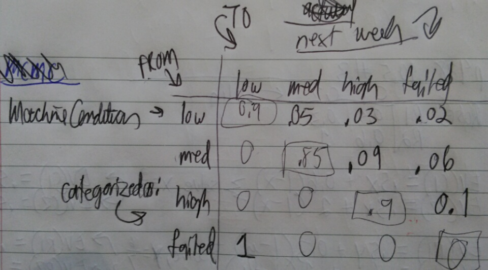

### 1a - Markov Transition Matrix



### 1b - A new machine always starts in the low state. What is the probability that the machine is in the failed state three weeks after it is new?

P(failed state exactly 3 weeks after it is new):

They all start in low, so the possibilities for the following 3 weeks (if it is to end in failure) are:

* low-low-failed
* low-med-failed
* low-high-failed
* med-med-failed
* med-high-failed
* high-high-failed
* failed-low-failed

```{r}
l_llf <- 0.9 * 0.9 * 0.02
l_lmf <- 0.9 * 0.05 * 0.06
l_lhf <- 0.9 * 0.03 * 0.1
l_mmf <- 0.05 * 0.85 * 0.06
l_mhf <- 0.05 * 0.09 * 0.1
l_hhf <- 0.03 * 0.9 * 0.1
l_flf <- 0.02 * 1 * 0.02

l_llf + l_lmf + l_lhf + l_mmf + l_mhf + l_hhf + l_flf
```

### 1c - probability of at least 1 failure

p(at least 1 failure) = 1 - p(no failure)

No failure can happen in the following ways:

* l_lll
* l_llm
* l_llh
* l_lmm
* l_lmh
* l_lhh

```{r}
l_lll <- 0.9 * 0.9 * 0.9
l_llm <- 0.9 * 0.9 * 0.05
l_llh <- 0.9 * 0.9 * 0.03
l_lmm <- 0.9 * 0.05 * 0.85
l_lmh <- 0.9 * 0.05 * 0.09
l_lhh <- 0.9 * 0.03 * 0.9

l_lll + l_llm + l_llh + l_lmm + l_lmh + l_lhh
```

### 1d - Expected Number of Weeks for New Machine until first failure?

Going to just code a simulation:

```{r}
get_next_state <- function(current_state, service_the_highs){
  rand_num <- runif(1, 0.0, 1.0)
  if("L" == current_state){
    if(rand_num <= 0.05){
      current_state <- "M"
    }else if(rand_num <= (0.05+0.03)){
      current_state <- "H"
      if(service_the_highs){
        current_state <- "F"
      }
    }else if(rand_num <= (0.05+0.03+0.02)){
      current_state <- "F"
    }else{
      # STAYS THE SAME
    }
  }else if("M" == current_state){
    if(rand_num <= 0.09){
      current_state <- "H"
      if(service_the_highs){
        current_state <- "F"
      }
    }else if(rand_num <= (0.09+0.06)){
      current_state <- "F"
    }else{
      # STAYS THE SAME
    }
  }else if("H" == current_state){
    if(rand_num <= 0.1){
      current_state <- "F"
    }else{
      # STAYS THE SAME
    }
  }else if("F" == current_state){
      current_state <- "L"
  }   
  return (current_state)
}

sample_size <- 1000 #0
#states <- c("L","M","H","F")
week_of_first_failure <- c()
for(i in 1:sample_size){
  current_state <- "L"
  current_week <- 0
  while(current_state != "F"){
    current_week <- current_week+1
    current_state <- get_next_state(current_state, FALSE)
  }
  week_of_first_failure <- c(week_of_first_failure, current_week)
}

hist(week_of_first_failure)
mean(week_of_first_failure)
```

### 1e - on average, how many weeks per year is the machine working?

```{r}
week_of_first_failure <- c()
num_weeks_working <- c()
for(i in 1:sample_size){
  current_state <- "L"
  weeks_working <- 0
  for(current_week in 1:52){
    current_state <- get_next_state(current_state, FALSE)
    if(current_state != "F"){
      weeks_working <- weeks_working + 1
    }
  }
  num_weeks_working <- c(num_weeks_working, weeks_working)
}

hist(num_weeks_working, breaks=8)
mean(num_weeks_working)
```

### 1f - given the weekly profits per state, whats the average profit per week realized by machine?

```{r}
# p250 help
f <- function(x, sigma){
  if(any(x <0))
    return (0)
  stopifnot(sigma > 0)
  return (x / sigma^2) * exp(-x^2 / 2 * sigma^2)
}

m <- 10000
sigma <- 4
x <- numeric(m)
x[1] <- rchisq(1, df=1)
k <- 0
u <- runif(m)

for(i in 2:m){
  xt <- x[i-1]
  y <- rchisq(1, df = xt)
  num <- f(y, sigma) * dchisq(xt, df = y)
  den <- f(xt, sigma) * dchisq(y, df = xt)
  if(u[i] < num/den) {
    x[i] <- y 
  }
  else {
    x[i] <- xt
    k <- k+1 # y is rejected
  }
}

print(k)
```

### 2 - RAO Genetic Linkage

```{r}
SIZE <- 1000
group_sizes <- c(125,18,20,34)

get_multinomial_probability <- function(theta){
  one <- (1/2) + (theta/4)
  two <- ((1-theta)/4)
  three <- ((1-theta)/4)
  four <- (theta/4)
  return (c(one, two, three, four))
}

get_posterior_given_observed <- function(observed_sample){
  proposal_dist <- runif(SIZE)
  other_dist <- rep(0,SIZE)
  # use metropolis hastings...
  other_dist[1] <- observed_sample[1]
  for(i in 2:SIZE){
    if(proposal_dist[i] > observed_sample[i])
        to_add <- min(1,(4))
    #if(proposal_dist[i])
  }  
}

get_posterior_distribution_given_observed_frequencies <- function(k1,k2,k3,k4,theta){
  return (((2+theta)^k1)*((1-theta)^(k2+k3))*((theta)^k4))  
}
```

### 3 - Perform Gibbs Sampling...

```{r}
NUM_ITERATIONS <- 1000
HYPER_PARAMS <- c(5,5,5,5,5)
PARAM_GUESSES <- c(6,7,8,9,10)
MPROB <- c()
# count data of coal mining accidents in the U.K. from 1851-1962
Y <- c(4,5,4,1,0,4,3,4,0,6,3,3,4,0,2,6,3,3,5,4,5,3,1,4,4,1,5,5,3,4,2,5,2,2,3,4,2,1,3,2,2,1,1,1,1,3,0,0,1,0,1,1,0,0,3,1,0,3,2,2,0,1,1,1,0,1,0,1,0,0,0,2,1,0,0,0,1,1,0,2,3,3,1,1,2,1,1,1,1,2,4,2,0,0,0,1,4,0,0,0,1,0,0,0,0,0,1,0,0,1,0,1)

m_change_pt <- 20

yi_lambda_poisson <- 0

#lanmbda_gamma <- 

```

### 4 - Implement Metropolist Hastings

The travelling salesman problem (TSP) asks the following question: "Given a list of cities and the distances between each pair of cities, what is the shortest possible route that visits each city exactly once and returns to the origin city?" 

```{r}
C <- matrix(c(0, 633, 257, 91, 412, 150, 80, 134, 259, 505, 353, 324, 70, 211, 268, 246, 121, 633, 0, 390, 661, 227, 488, 572, 530, 555, 289, 282, 638, 567, 466, 420, 745, 518, 257, 390, 0, 228, 169, 112, 196, 154, 372, 262, 110, 437, 191, 74, 53, 472, 142, 91, 661, 228, 0, 383, 120, 77, 105, 175, 476, 324, 240, 27, 182, 239, 237, 84, 412, 227, 169, 383, 0, 267, 351, 309, 338, 196, 61, 421, 346, 243, 199, 528, 297, 150, 488, 112, 120, 267, 0, 63, 34, 264, 360, 208, 329, 83, 105, 123, 364, 35, 80, 572, 196, 77, 351, 63, 0, 29, 232, 444, 292, 297, 47, 150, 207, 332, 29, 134, 530, 154, 105, 309, 34, 29, 0, 249, 402, 250, 314, 68, 108, 165, 349, 36, 259, 555, 372, 175, 338, 264, 232, 249, 0, 495, 352, 95, 189, 326, 383, 202, 236, 505, 289, 262, 476, 196, 360, 444, 402, 495, 0, 154, 578, 439, 336, 240, 685, 390, 353, 282, 110, 324, 61, 208, 292, 250, 352, 154, 0, 435, 287, 184, 140, 542, 238, 324, 638, 437, 240, 421, 329, 297, 314, 95, 578, 435, 0, 254, 391, 448, 157, 301, 70, 567, 191, 27, 346, 83, 47, 68, 189, 439, 287, 254, 0, 145, 202, 289, 55, 211, 466, 74, 182, 243, 105, 150, 108, 326, 336, 184, 391, 145, 0, 57, 426, 96, 268, 420, 53, 239, 199, 123, 207, 165, 383, 240, 140, 448, 202, 57, 0, 483, 153, 246, 745, 472, 237, 528, 364, 332, 349, 202, 685, 542, 157, 289, 426, 483, 0, 336, 121, 518, 142, 84, 297, 35, 29, 36, 236, 390, 238, 301, 55, 96, 153, 336, 0),ncol=17)

required_cities <- C[1,2:17]
required_cities

calculate_cost <- function(indexes_ordered, use_MH){
  current_cost <- 0
  for(i in 1:16){
    next_city_index <- i+1
    value <- C[indexes_ordered[i],indexes_ordered[next_city_index]]
    if(use_MH && i < 16){
      index_to_maybe_swap <- runif(1, i+2, 17)
      maybe_value <- C[indexes_ordered[i],indexes_ordered[index_to_maybe_swap]]
      if(maybe_value < value){
        value <- maybe_value
      }else{
        pct_chance_of_taking_worse_value <- value / maybe_value
        rand_num_0_to_1 <- runif(1)
        if(pct_chance_of_taking_worse_value > rand_num_0_to_1){
          value <- maybe_value
        }
      }
    }
    current_cost <- current_cost + value
  }
  return (current_cost)
}

total_distances_with_mh <- c()
total_distances_without_mh <- c()
for(i in 1:1000){
  cities_path <- sample(1:17)

  sum_of_this_path_with_mh <- calculate_cost(cities_path, TRUE)
  total_distances_with_mh <- c(total_distances_with_mh, sum_of_this_path_with_mh)
  
  sum_of_this_path_without_mh <- calculate_cost(cities_path, FALSE)
  total_distances_without_mh <- c(total_distances_without_mh, sum_of_this_path_without_mh)
}
hist(total_distances_with_mh)
hist(total_distances_without_mh)

```

Looks like using the MH got us there faster :)

### All Code

-```{r code=readLines(knitr::purl('DATA_604_HW_3.Rmd', documentation = 0)), eval = FALSE}

-```