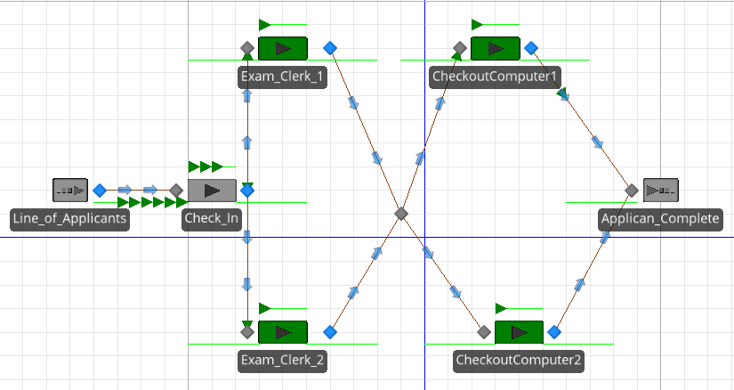
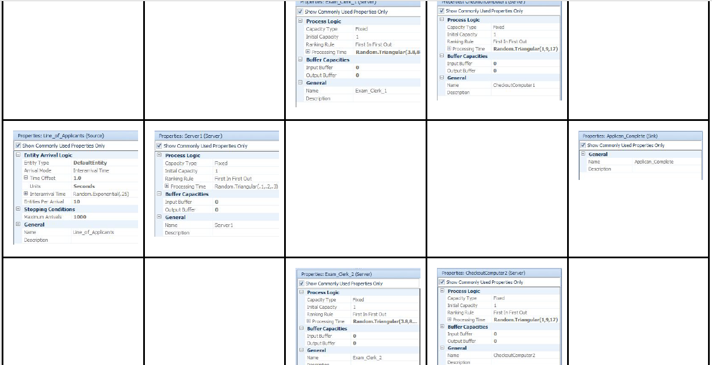
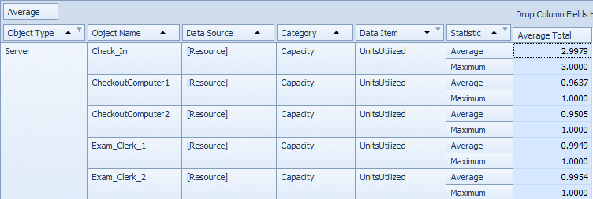
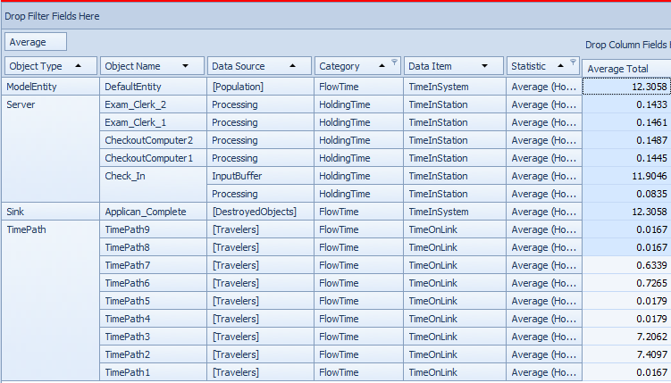
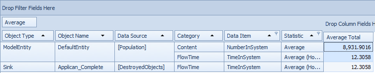

# Simeo Model

The model: 1 source, 1 sink, 4 total servers.



Specs:



Server Utilization:



Time in System:



Number in System:




# 2) M/M/1 Queue

```{r }
# some help from: https://www.r-bloggers.com/simulating-a-queue-in-r/
t.end   <- 10^5 # duration of sim
t.clock <- 0    # sim time
Ta <- 10    # interarrival period
Ts <- 7    # service period
t1 <- 0         # time for next arrival
t2 <- t.end     # time for next departure
tn <- t.clock   # tmp var for last event time
tb <- 0         # tmp var for last busy-time start
n <- 0          # number in system
s <- 0          # cumulative number-time product
b <- 0          # total busy time
c <- 0          # total completions
qc <- 0         # plot instantaneous q size
tc <- 0         # plot time delta
plotSamples <- 100
set.seed(1)

############################

while (t.clock < t.end) {
    if (t1 < t2) {      # arrival event
        t.clock <- t1
        s <- s + n * (t.clock - tn)  # delta time-weighted number in queue
        n <- n + 1
        if (t.clock < plotSamples) { 
            qc <- append(qc,n)
            tc <- append(tc,t.clock) 
        }
        tn <- t.clock
        t1 <- t.clock + rexp(1, 1/Ta)
        if(n == 1) { 
            tb <- t.clock
            t2 <- t.clock + rexp(1, 1/Ts)  # exponential  interarrival period
        }
    } else {            # departure event
        t.clock <- t2
        s <- s + n * (t.clock - tn)  # delta time-weighted number in queue
        n <- n - 1
        if (t.clock < plotSamples) { 
            qc <- append(qc,n)
            tc <- append(tc,t.clock)
        }
        tn <- t.clock
        c <- c + 1
        if (n > 0) { 
            t2 <- t.clock + rexp(1, 1/Ts)  # exponential  service period
        }
        else { 
            t2 <- t.end
            b <- b + t.clock - tb
        }
    }   
}

##########################

u <- b/t.clock       # utilization B/T
u
N <- s/t.clock       # mean queue length (see the Load Average notes)
N
x <- c/t.clock       # mean throughput C/T
x
r <- N/x             # mean residence time (from Little's law: Q = XR)
r
q <- sum(qc)/max(tc) # estimated queue length for plot
q

```

# 3a) p268 - 6.1

```{r }
day_of_minutes <- 24 * 60 # * 7

minutes_between_arrivals <- 4
minutes_to_service_mechanic <- 3

attendant_cost_per_hour <- 10
mechanic_cost_per_hour <- 15

run_sim_1 <- function(with_2nd_attendant){
  final_num_serviced <- 0
  service_available_at <- 0
  
  arrival_time_index <- 0
  arrival_times <- rnorm(10000, minutes_between_arrivals)
  service_times_1 <- rnorm(10000, minutes_to_service_mechanic)
  service_times_2 <- rnorm(10000, minutes_to_service_mechanic)
  # cant have negatives:
  arrival_times[arrival_times < 0] <- 0
  service_times_1[service_times_1 < 0] <- 0
  service_times_2[service_times_2 < 0] <- 0

    
  for(m in 1:length(arrival_times)){
    if(service_available_at < day_of_minutes){
      arrival_time_index <- arrival_time_index + arrival_times[m]
      #print(arrival_time_index)
      if(service_available_at < arrival_time_index){
        final_num_serviced <- final_num_serviced + 1
        service_available_at <- service_available_at + service_times_1[m]
      }
      if(with_2nd_attendant){
        if(service_available_at < arrival_time_index){
          final_num_serviced <- final_num_serviced + 1
          service_available_at <- service_available_at + service_times_2[m]
        }
      }
    
    }
  }
  return (final_num_serviced)
}

with_1 <- c()
with_2 <- c()

for(i in 1:100){
  with_1 <- c(with_1, run_sim_1(FALSE))
  with_2 <- c(with_2, run_sim_1(TRUE))
}

hist(with_1)
hist(with_2)
hist(with_2 - with_1)
mean(with_2 - with_1)
```

### For 3a, it seems that using 2 does not change the number serviced, so unless the profit for any extra served was HUGE, it would not pay to have the 2nd serviced.

# 3b) p269 - 6.2

```{r}

arrival_rate_seconds <- c(1:90)
num_failures_for_num_seconds <- c()

runway_taken <- FALSE
for(a in arrival_rate_seconds){
  failures_for_rate <- 0
  # do 1000 trials
  for(x in 1:1000){
    # AVERAGE WAIT IN SKY NOT TO EXCEED 3 MINUTES
    seconds_to_land <- rnorm(1000, 90)
    # cant have negatives:
    seconds_to_land[seconds_to_land < 0] <- 0

  }    
  num_failures_for_num_seconds[a] <- 40    
}

plot(arrival_rate_seconds, num_failures_for_num_seconds)
```

